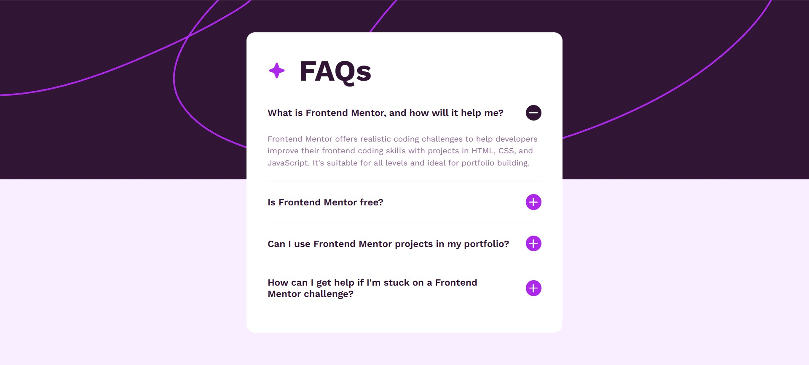

# Frontend Mentor - FAQ Accordion Solution

This is a solution to
the [FAQ accordion challenge on Frontend Mentor](https://www.frontendmentor.io/challenges/faq-accordion-wyfFdeBwBz).
Frontend Mentor challenges help you improve your coding skills by building realistic projects.

## Table of contents

- [Overview](#overview)
    - [The challenge](#the-challenge)
    - [Screenshot](#screenshot)
    - [Links](#links)
- [My process](#my-process)
    - [Built with](#built-with)
    - [What I learned](#what-i-learned)
    - [Continued development](#continued-development)
    - [Useful resources](#useful-resources)
- [Author](#author)
- [Acknowledgments](#acknowledgments)

## Overview

### The challenge

Users should be able to:

- Hide/Show the answer to a question when the question is clicked
- Navigate the questions and hide/show answers using keyboard navigation alone
- View the optimal layout for the interface depending on their device's screen size
- See hover and focus states for all interactive elements on the page

### Screenshot



### Links

- Solution URL: [GitHub](https://github.com/runny-life/faq-accordion)
- Live Site URL: [GitHub Pages](https://runny-life.github.io/faq-accordion/)

## My process

### Built with

- Semantic HTML5 markup
- CSS custom properties
- Flexbox
- Mobile-first workflow
- Vanilla JavaScript
- Native `<details>` and `<summary>` elements
- CSS animations and transitions

### What I learned

This project was a great opportunity to work with native HTML `<details>` and `<summary>` elements while maintaining
full accessibility and custom styling. Here are some key takeaways:

#### 1. Custom Styling of `<details>` and `<summary>`

The native disclosure widget comes with default browser styles that needed to be overridden:

```css
.faq__summary {
  list-style: none;
}

.faq__summary::-webkit-details-marker {
  display: none;
}
```

#### 2. Custom Toggle Icon with CSS

Instead of using images or SVGs for the toggle icon, I created a plus/minus icon using pure CSS with pseudo-elements:

```css
.faq__icon::before,
.faq__icon::after {
  content: "";
  position: absolute;
  top: 50%;
  left: 50%;
  translate: -50% -50%;
  width: 1rem;
  height: 0.125rem;
  border-radius: 12px;
  background-color: var(--color-white);
}

.faq__icon::after {
  rotate: 90deg;
  transition: rotate 0.3s;
}

.faq__details[open] .faq__icon::after {
  rotate: 0deg;
}
```

#### 3. Smooth Height Animations

One of the challenges with `<details>` is that you can't animate the `height` property directly. I solved this by using
a wrapper with `max-height` and `opacity` transitions:

```css
.faq__answer-wrapper {
  max-height: 0;
  opacity: 0;
  overflow: hidden;
  transition: max-height 0.5s cubic-bezier(0.4, 0, 0.2, 1),
  opacity 0.4s ease 0.05s,
  padding 0.4s ease;
  padding: 0 0 0 0;
}

.faq__details.is-open .faq__answer-wrapper {
  max-height: 500px;
  opacity: 1;
  padding: 0 0 1.5rem 0;
}
```

#### 4. Accordion Behavior (Only One Open at a Time)

Using JavaScript, I ensured that only one FAQ item can be open at a time. I also managed ARIA attributes for better
accessibility:

```javascript
function onToggleDetail() {
  const isOpen = this.open;
  this.querySelector("summary").setAttribute("aria-expanded", isOpen ? "true" : "false");

  if (isOpen) {
    detailsElements.forEach(other => {
      if (other !== this && other.open) {
        other.open = false;
        other.querySelector("summary").setAttribute("aria-expanded", "false");
      }
    });
  }

  this.classList.toggle("is-open", isOpen);
}
```

#### 5. Responsive Typography with `clamp()`

To create truly fluid typography, I used the `clamp()` function:

```css
font-size:

clamp
(
0.875
rem,

0.815
rem +

0.254
vw,

0.938
rem

)
;
font-size:

clamp
(
2
rem,

0.569
rem +

6.107
vw,

3.5
rem

)
;
```

#### 6. Keyboard Accessibility

The native `<details>` element provides keyboard navigation out of the box. Users can:

- Press `Enter` or `Space` to toggle the details
- Use `Tab` to navigate between interactive elements

#### 7. Hover and Focus States

```css
.faq__summary:focus-visible {
  outline: 2px dashed var(--color-violet-600);
  outline-offset: 4px;
  transition-duration: 0s;
}

@media (hover: hover) {
  .faq__summary:hover .faq__question {
    color: var(--color-violet-600);
  }
}
```

### Continued development

In future projects, I want to continue focusing on:

1. **Accessibility Best Practices**: Ensuring that all interactive elements have proper ARIA attributes and keyboard
   support
2. **CSS Animations**: Creating more sophisticated and performant animations using CSS
3. **Fluid Typography**: Mastering the use of `clamp()` and `calc()` for truly responsive designs
4. **Form Accessibility**: Working with other form elements and ensuring they're fully accessible
5. **Performance**: Optimizing CSS and JavaScript for better loading times

### Useful resources

- [MDN Web Docs: `<details>` and `<summary>`](https://developer.mozilla.org/en-US/docs/Web/HTML/Element/details) -
  Comprehensive documentation on the native disclosure widget
- [CSS `clamp()` Function](https://developer.mozilla.org/en-US/docs/Web/CSS/clamp) - For creating fluid typography and
  responsive designs
- [CSS `:focus-visible` Pseudo-class](https://developer.mozilla.org/en-US/docs/Web/CSS/:focus-visible) - For better
  focus styling that works with keyboard navigation
- [ARIA Authoring Practices Guide](https://www.w3.org/WAI/ARIA/apg/) - For building accessible interactive components

## Author

- Website - [GitHub](https://github.com/runny-life)
- Frontend Mentor - [@runny-life](https://www.frontendmentor.io/profile/runny-life)

## Acknowledgments

This project was completed as part of the Frontend Mentor challenge. The design and requirements were provided by
Frontend Mentor. Special thanks to the Frontend Mentor community for providing feedback and inspiration.